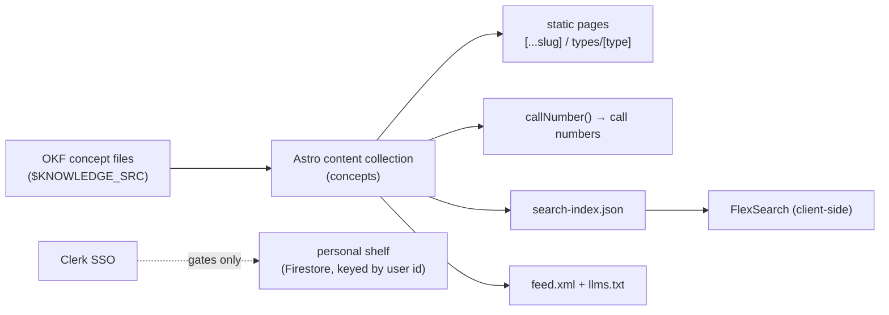

# oriz-knowledge-site — the Card Catalogue

> Astro source for [knowledge.oriz.in](https://knowledge.oriz.in) — an Open Knowledge Format (OKF) knowledge base rendered as a library card catalogue: one index card per concept, each with a call number, a heading, and cross-references.

[](./LICENSE)
[](https://github.com/chirag127/oriz-knowledge-site/stargazers)
[](https://github.com/chirag127/oriz-knowledge-site/commits/main)
[](https://github.com/chirag127/oriz-knowledge-site/actions/workflows/publish.yml)
[](https://astro.build)

## What it is / why it exists

A working engineer's second brain, kept the way a library keeps its holdings. Every locked decision, rule, runbook, service note, and glossary entry becomes one card with a call number, a heading, and the rule of thumb that put it there — pull a drawer, read the card, follow the cross-reference. It builds a static site from a directory of OKF concept files (path set by `KNOWLEDGE_SRC`), with client-side FlexSearch over titles, descriptions, and tags. Public content is never gated; Clerk auth exists only for a private per-user "shelf".

## Links

- **Live site:** https://knowledge.oriz.in _(canonical — served from Cloudflare Pages)_
- **Repo:** https://github.com/chirag127/oriz-knowledge-site
- **Feed:** https://knowledge.oriz.in/feed.xml · **For LLMs:** https://knowledge.oriz.in/llms.txt

_No GitHub Pages info page for this repo — knowledge.oriz.in is the canonical URL._

⭐ If this is useful, please **star the repo** — it helps others find it.

## How it's built



## Features

- **One card per concept** — call number, heading, description, cross-references; drawers grouped by type (decision, rule, runbook, service, glossary, reference, index, security).
- **Client-side search** — FlexSearch over titles + descriptions + tags, no server round-trip.
- **Machine-readable** — `feed.xml` (RSS) and `llms.txt` / `llms-full.txt` for AI agents.
- **Personal shelf (optional)** — Clerk sign-in gates *only* the private shelf; all public content reads without auth.
- **Reading-room design** — its own distinct identity (Fraunces display, Hanken Grotesk body, Spline Sans Mono for call numbers); reduced-motion respected.
- **AI note polish** — optional `@chirag127/oz-ai` (keyless g4f, multi-provider failover) that degrades gracefully.

## Tech stack

- **Astro 5** — static generation from a content collection.
- **Tailwind v4** via `@tailwindcss/vite`.
- **React 19** islands — search, Clerk account panel, "file on shelf".
- **FlexSearch** — client-side full-text look-up.
- **@clerk/clerk-react** — auth (shared `*.oriz.in` SSO); gates only the personal shelf.
- **Firebase (Firestore only)** — per-user shelf, keyed by Clerk user id (Clerk owns auth).
- **zod** — content-schema validation. **@astrojs/mdx / rss / sitemap**.

## Repo structure

```
src/
  components/
    ClerkIsland.tsx    # Clerk account island (gates the shelf only)
    SignInPanel.tsx
    NoteAI.tsx         # optional oz-ai note polish
  layouts/BaseLayout.astro
  lib/
    callNumber.ts      # derives a library call number per concept
    firebase.ts        # Firestore client (per-user shelf)
  pages/
    index.astro        # the drawer face / catalogue home
    [...slug].astro    # one page per concept card
    types/[type].astro # a drawer per concept type
    search-index.json.ts # FlexSearch index
    feed.xml.ts · llms.txt.ts
  content.config.ts    # OKF concept collection (zod schema)
astro.config.mjs       # site: https://knowledge.oriz.in
```

## Quick start

Windows: use **npm**, not pnpm (pnpm skips `@esbuild/win32-x64`).

```bash
npm install --legacy-peer-deps
KNOWLEDGE_SRC=/absolute/path/to/knowledge npm run dev   # local dev
npm run build     # static dist/
npm run preview   # preview the build
npm run deploy    # build + wrangler pages deploy (project: oriz-knowledge-site)
```

Copy `.env.example` → `.env` for Clerk + Firebase (all `PUBLIC_*`, browser-safe).

## Configuration

Names + purpose only — never commit real values. `PUBLIC_*` keys are shipped to the browser by design; there is no server secret in this repo.

| Variable | Purpose |
| --- | --- |
| `PUBLIC_CLERK_PUBLISHABLE_KEY` | Clerk publishable key; gates *only* the personal shelf. |
| `PUBLIC_FIREBASE_API_KEY` | Firebase Web API key (Firestore client). |
| `PUBLIC_FIREBASE_AUTH_DOMAIN` | Firebase auth domain. |
| `PUBLIC_FIREBASE_PROJECT_ID` | Firebase / Firestore project id. |
| `PUBLIC_FIREBASE_STORAGE_BUCKET` | Firebase storage bucket. |
| `PUBLIC_FIREBASE_MESSAGING_SENDER_ID` | Firebase messaging sender id. |
| `PUBLIC_FIREBASE_APP_ID` | Firebase app id. |
| `KNOWLEDGE_SRC` | Build-time only (not shipped) — absolute path to the OKF knowledge directory. |

## Part of the oriz family

One of ~80 sites in the **oriz** family. See how the fleet is built at [blog.oriz.in](https://blog.oriz.in).

- **Cost:** $0 on the Cloudflare free tier.

## Security

No secrets in the repo; the fleet uses a **sops + age** vault (`.env.enc`). Only `PUBLIC_*` client keys ship to the browser; the Clerk secret key is never present here and never named `PUBLIC_*_SECRET`.

## Contributing

Issues and PRs welcome — keep them terse. Conventional commits, `main`-only.

## Status / roadmap

Stable and live at knowledge.oriz.in. Content grows continuously; the site rebuilds on push and on `knowledge-updated` dispatch.

## Changelog

Conventional commits are the changelog.

## License

MIT © 2026 Chirag Singhal — see [LICENSE](./LICENSE).

## Author

Chirag Singhal · chirag@oriz.in
